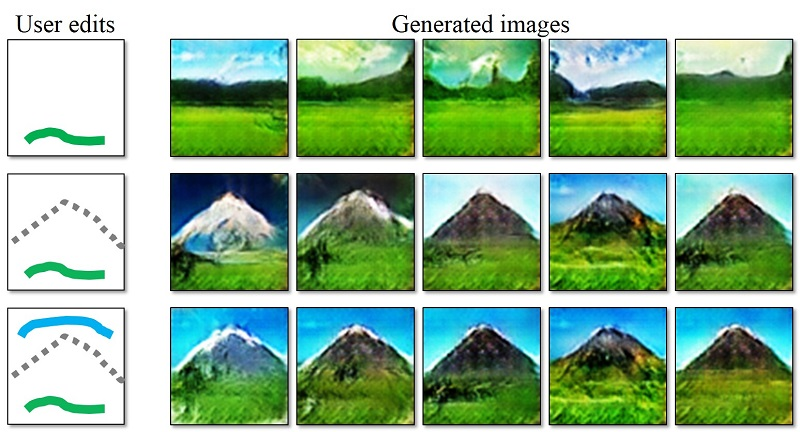
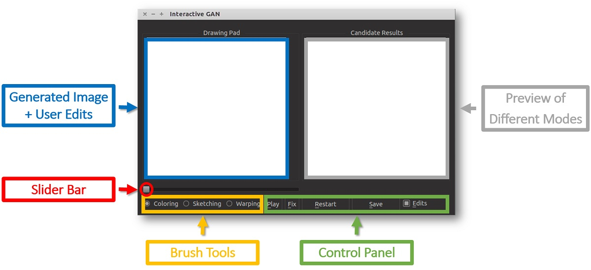
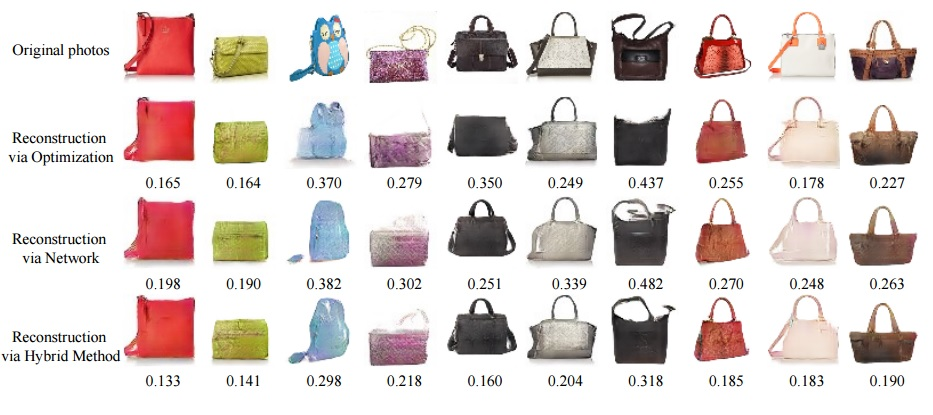
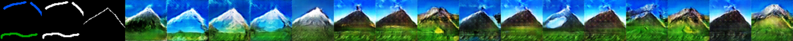

## iGAN: Interactive Image Generation via Generative Adversarial Networks
[[Project]](http://www.eecs.berkeley.edu/~junyanz/projects/gvm/) [[Youtube]](https://youtu.be/9c4z6YsBGQ0)   [[Paper]](https://arxiv.org/pdf/1609.03552v2.pdf)  
A research prototype developed by UC Berkeley and Adobe CTL.  


## Overview
iGAN (aka. interactive GAN) is the author's implementation of interactive image generation interface described in:  
"Generative Visual Manipulation on the Natural Image Manifold"   
[Jun-Yan Zhu](https://people.eecs.berkeley.edu/~junyanz/), [Philipp Krähenbühl](http://www.philkr.net/), [Eli Shechtman](https://research.adobe.com/person/eli-shechtman/), [Alexei A. Efros](https://people.eecs.berkeley.edu/~efros/)    
In European Conference on Computer Vision (ECCV) 2016




Given a few user strokes, our system could produce photo-realistic samples that best satisfy the user edits at real-time. Our system is based on deep generative models such as Generative Adversarial Networks ([GAN](https://arxiv.org/abs/1406.2661)) and [DCGAN](https://github.com/Newmu/dcgan_code). The system serves the following two purposes:
* An intelligent drawing interface for automatically generating images inspired by the color and shape of the brush strokes.
* An interactive visual debugging tool for understanding and visualizing deep generative models. By interacting with the  generative model, a developer can understand what visual content the model can produce, as well as the limitation of the model.

We are working on supporting more generative models (e.g. variational autoencoder) and more deep learning frameworks (e.g. Tensorflow). You are welcome to propose new changes or contribute new features (e.g. Tensorflow branch) via pull requests. Please cite our paper if you find this code useful in your research.

Contact: Jun-Yan Zhu (junyanz@berkeley.edu)

## Getting started
* Install the python libraries. (See `Requirements`).
* Download the code from GitHub:
```bash
git clone https://github.com/junyanz/iGAN
cd iGAN
```
* Download the model. (See `Model Zoo` for details):
``` bash
bash ./models/scripts/download_dcgan_model.sh outdoor_64
```

* Run the python script:
``` bash
THEANO_FLAGS='device=gpu0, floatX=float32, nvcc.fastmath=True' python iGAN_main.py --model_name outdoor_64
```

## Requirements
The code is written in Python2 and requires the following 3rd party libraries:
* numpy
* [OpenCV](http://opencv.org/)
```bash
sudo apt-get install python-opencv
```
* [Theano](https://github.com/Theano/Theano)
```bash
sudo pip install --upgrade --no-deps git+git://github.com/Theano/Theano.git
```
* [PyQt4](https://wiki.python.org/moin/PyQt4): more details on Qt installation can be found [here](http://www.saltycrane.com/blog/2008/01/how-to-install-pyqt4-on-ubuntu-linux/)
```bash
sudo apt-get install python-qt4
```
* [Qdarkstyle](https://github.com/ColinDuquesnoy/QDarkStyleSheet)
```bash
sudo pip install qdarkstyle
```
* [dominate](https://github.com/Knio/dominate)
```bash
sudo pip install dominate
```
* GPU + CUDA + cuDNN:
The code is tested on GTX Titan X + CUDA 7.5 + cuDNN 5.  Here are the tutorials on how to install [CUDA](http://www.r-tutor.com/gpu-computing/cuda-installation/cuda7.5-ubuntu) and [cuDNN](http://askubuntu.com/questions/767269/how-can-i-install-cudnn-on-ubuntu-16-04). A decent GPU is required to run the system at real-time. [**Warning**] If you run the program on a gpu server, you need to use a remote desktop software (e.g. VNC), which may introduce display artifacts and latency problem.

## Python3
For `Python3` users, you need to replace `pip` with `pip3`:
* PyQt4 with Python3:
``` bash
sudo apt-get install python3-pyqt4
```
* OpenCV3 with Python3: see the installation [instruction](http://www.pyimagesearch.com/2015/07/20/install-opencv-3-0-and-python-3-4-on-ubuntu/).


## Interface:
See [[Youtube]](https://youtu.be/9c4z6YsBGQ0?t=2m18s) at 2:18s for the interactive image generation demos.  

  

#### Layout
* Drawing Pad: This is the main window of our interface. A user can apply different edits via our brush tools and the system will display the generated image. Check/Uncheck `Edits` button to display/hide user edits.  
* Candidate Results: a display showing thumbnails of all the candidate results (e.g. different modes) that fits the user edits. A user can click a mode (highlighted by a green rectangle), and the drawing pad will show this result.
* Brush Tools:  `Coloring Brush` for changing the color of a specific region; `Sketching brush` for outlining the shape. `Warping brush` for modifying the shape more explicitly.
* Slider Bar: drag the slider bar to explore the interpolation sequence between the initial result (i.e. random generated image) and the current result (e.g. image that satisfies the user edits).
* Control Panel: `Play`: play the interpolation sequence; `Fix`: use the current result as additional constraints for further editing  `Restart`: restart the system; `Save`: save the result to a webpage. `Edits`: Check the box if you would like to show the edits on top of the generated image.


#### User interaction
* `Coloring Brush`:  right click to select a color; hold left click to paint; scroll the mouse wheel to adjust the width of the brush.
* `Sketching Brush`: hold left click to sketch the shape.
* `Warping Brush`: We recommend you first use coloring and sketching before the warping brush. Right click to select a square region; hold left click to drag the region; scroll the mouse wheel to adjust the size of the square region.
* Shortcuts: P for `Play`, F for `Fix`, R for `Restart`; S for `Save`; E for `Edits`; Q for quitting the program.
* Tooltips: when you move the cursor over a button , the system will display the tooltip of the button.


## Model Zoo:
Download the theano DCGAN model (e.g. outdoor_64). Before using our system, please check out the random real images vs. DCGAN generated samples to see which kind of images that a model can produce.

``` bash
bash ./models/scripts/download_dcgan_model.sh outdoor_64
```
* [ourdoor_64.dcgan_theano](https://people.eecs.berkeley.edu/~junyanz/projects/gvm/models_dev/theano_dcgan/outdoor_64.dcgan_theano) (64x64): trained on 150K landscape images from MIT [Places](http://places.csail.mit.edu/) dataset [[Real](https://people.eecs.berkeley.edu/~junyanz/projects/gvm/samples/outdoor_64_real.png) vs. [DCGAN](https://people.eecs.berkeley.edu/~junyanz/projects/gvm/samples/outdoor_64_dcgan.png)].
* [church_64.dcgan_theano](https://people.eecs.berkeley.edu/~junyanz/projects/gvm/models_dev/theano_dcgan/church_64.dcgan_theano) (64x64): trained on 126k church images from the [LSUN](http://lsun.cs.princeton.edu/2016/) challenge [[Real](https://people.eecs.berkeley.edu/~junyanz/projects/gvm/samples/church_64_real.png) vs. [DCGAN](https://people.eecs.berkeley.edu/~junyanz/projects/gvm/samples/church_64_dcgan.png)].
* [handbag_64.dcgan_theano](https://people.eecs.berkeley.edu/~junyanz/projects/gvm/models_dev/theano_dcgan/handbag_64.dcgan_theano) (64x64): trained on 137K handbag images downloaded from Amazon [[Real](https://people.eecs.berkeley.edu/~junyanz/projects/gvm/samples/handbag_64_real.png) vs. [DCGAN](https://people.eecs.berkeley.edu/~junyanz/projects/gvm/samples/handbag_64_dcgan.png)].
* [shoes_64.dcgan_theano](https://people.eecs.berkeley.edu/~junyanz/projects/gvm/models_dev/theano_dcgan/shoes_64.dcgan_theano) (64x64): trained on 50K shoes images collected by [Yu and Grauman](http://vision.cs.utexas.edu/projects/finegrained/utzap50k/) [[Real](https://people.eecs.berkeley.edu/~junyanz/projects/gvm/samples/shoes_64_real.png) vs. [DCGAN](https://people.eecs.berkeley.edu/~junyanz/projects/gvm/samples/shoes_64_dcgan.png)].
* [hed_shoes_64.dcgan_theano](https://people.eecs.berkeley.edu/~junyanz/projects/gvm/models_dev/theano_dcgan/hed_shoes_64.dcgan_theano) (64x64): trained on 50K shoes sketches (computed by [HED](https://github.com/s9xie/hed)) [[Real](https://people.eecs.berkeley.edu/~junyanz/projects/gvm/samples/hed_shoes_64_real.png) vs. [DCGAN](https://people.eecs.berkeley.edu/~junyanz/projects/gvm/samples/hed_shoes_64_dcgan.png)]. (Use this model with `--shadow` flag)

We provide a simple script to generate samples from a pre-trained DCGAN model. You can run this script to test if Theano, CUDA, cuDNN are configured properly before running our interface.
```bash
THEANO_FLAGS='device=gpu0, floatX=float32, nvcc.fastmath=True' python generate_samples.py --model_name outdoor_64 --output_image outdoor_64_dcgan.png
```


## Command line arguments:
Type `python iGAN_main.py --help` for a complete list of the arguments. Here we discuss some important arguments:
* `--model_name`: the name of the model (e.g. outdoor_64, shoes_64, etc.)
* `--model_type`: currently only supports dcgan_theano.
* `--model_file`: the file that stores the generative model; If not specified, `model_file='./models/%s.%s' % (model_name, model_type)`
* `--top_k`: the number of the candidate results being displayed
* `--average`: show average image in the main window. Inspired by [AverageExplorer](https://people.eecs.berkeley.edu/~junyanz/projects/averageExplorer/), average image is a weighted average of multiple generated results, with the weights reflecting user-indicated importance. You can switch between average mode and normal mode by press `A`.
* `--shadow`: We build a sketching assistance system for guiding the freeform drawing of objects inspired by [ShadowDraw](http://vision.cs.utexas.edu/projects/shadowdraw/shadowdraw.html)
To use the interface, download the model `hed_shoes_64` and run the following script
```bash
THEANO_FLAGS='device=gpu0, floatX=float32, nvcc.fastmath=True' python iGAN_main.py --model_name hed_shoes_64 --shadow --average
```

## Dataset and Training
See more details [here](./train_dcgan/README.md)

## Projecting an Image onto Latent Space


We provide a script to project an image into latent space (i.e. `x->z`):
* Download the pre-trained AlexNet model (`conv4`):
```bash
bash models/scripts/download_alexnet.sh conv4
```
* Run the following script with a model and an input image. (e.g. model: `shoes_64.dcgan_theano`, and input image `./pics/shoes_test.png`)
```bash
THEANO_FLAGS='device=gpu0, floatX=float32, nvcc.fastmath=True' python iGAN_predict.py --model_name shoes_64 --input_image ./pics/shoes_test.png --solver cnn_opt
```
* Check the result saved in `./pics/shoes_test_cnn_opt.png`
* We provide three methods: `opt` for optimization method; `cnn` for feed-forward network method (fastest); `cnn_opt` hybrid of the previous methods (default and best). Type `python iGAN_predict.py --help` for a complete list of the arguments.

## Script without UI


We also provide a standalone script that should work without UI. Given user constraints (i.e. a color map, a color mask and an edge map), the script generates multiple images that mostly satisfy the user constraints. See `python iGAN_script.py --help` for more details.
```bash
THEANO_FLAGS='device=gpu0, floatX=float32, nvcc.fastmath=True' python iGAN_script.py --model_name outdoor_64
```


## TODO
* ~~Support Python3.~~
* ~~Add image datasets.~~
* ~~Support average image mode.~~
* ~~Add the DCGAN model training script.~~  
* ~~Support sketch models for sketching guidance.~~
* ~~Add the script for projecting an image to the latent vector `z`.~~
* ~~Add a standalone script without UI.~~
* Add 128x128 models.
* Support other deep learning frameworks (e.g. Tensorflow).
* Support other deep generative models (e.g. variational autoencoder).
* Support image morphing mode.
* Support image editing mode.

## Citation
```
@inproceedings{zhu2016generative,
  title={Generative Visual Manipulation on the Natural Image Manifold},
  author={Zhu, Jun-Yan and Kr{\"a}henb{\"u}hl, Philipp and Shechtman, Eli and Efros, Alexei A.},
  booktitle={Proceedings of European Conference on Computer Vision (ECCV)},
  year={2016}
}
```

## Cat Paper Collection
If you love cats, and love reading cool graphics, vision, and learning papers, please check out our Cat Paper Collection:  
[[Github]](https://github.com/junyanz/CatPapers) [[Webpage]](http://people.eecs.berkeley.edu/~junyanz/cat/cat_papers.html)

## Acknowledgement
* We modified the DCGAN [code](https://github.com/Newmu/dcgan_code) in our package. Thanks the authors for sharing the code. Please cite the original [DCGAN](https://arxiv.org/abs/1511.06434) paper if you use their models.
* This work was supported, in part, by funding from Adobe, eBay and Intel, as well as a hardware grant from NVIDIA. J.-Y. Zhu is supported by Facebook Graduate Fellowship.
